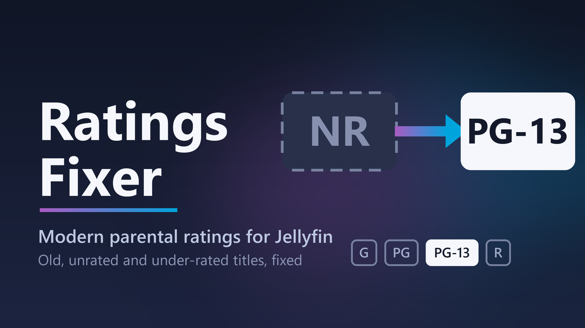

# Ratings Fixer for Jellyfin



A Jellyfin plugin that re-rates your library to **modern parental-rating standards**, so Jellyfin's
built-in parental controls actually work on older and unrated titles — and keeps those corrections safe
from metadata refreshes.

**Version 1.3** · Jellyfin **12.1+** · [Changelog](CHANGELOG.md) · [Design notes](docs/DESIGN.md)

> [!WARNING]
> **Back up Jellyfin's database before your first Apply** (Dashboard → Backups, or copy `jellyfin.db`
> with the server stopped). Apply edits thousands of items at once. Every change is recorded in the
> plugin's ledger so it can be re-applied, but only a database backup can undo it.

## The problem

Jellyfin's parental controls are only as good as each item's rating, and film ratings have a
history problem:

- **Films older than the rating system were never re-rated.** A pre-1968 US film typically carries
  `Approved` or `Passed` (a Production Code seal, not an age rating) — and Jellyfin scores `Approved`
  the same as `G`.
- **Old ratings were often under-classified.** Other countries' boards (BBFC, FSK, …) routinely
  re-rate old films on re-release, but the US rating in your metadata never changes.
- **Large parts of a typical library are simply unrated** (`NR`, `Not Rated`, blank).
- **Manual fixes don't stick.** Editing the official rating by hand is undone by the next metadata refresh.

## What it does

- Writes corrected ratings to each item's **Custom Rating**. Parental controls enforce it, metadata
  providers never overwrite it, and the official rating stays untouched for reference.
- Decides each title's rating from, in order:
  1. **Your rules** — e.g. everything in the collection “Adult” → `XXX`. Rules win outright.
  2. The **consensus** of current **TMDb certifications** from the countries you choose (each country's
     most recent certification, so re-releases count), **TVDb** content ratings for series (optional),
     and the **Common Sense Media** age (via MDBList). One unusually strict country can't re-rate a
     title on its own. Titles without a TMDb id are looked up by their IMDb or TVDb id.
  3. For titles none of those rate: **fallback countries**, then optionally **OMDb** (IMDb's US rating).
  4. **Legacy mappings** for strings Jellyfin can't score (e.g. `GP` → `PG`). A source answering
     `Approved` or `Passed` is ignored rather than taken as `G`.
- Maps the result to the **nearest** rating on a ladder per type — by default movies `G, PG, PG-13, R, NC-17`
  and series `TV-Y … TV-MA`, so a BBFC 12A becomes `PG-13` and an FSK 16 becomes `R`. Presets fill in
  the ladders for the UK, Canada, Ireland, Germany, Australia and New Zealand. A foreign 18 becomes
  `R`, never `NC-17`; `NC-17` and `XXX` only come from your rules or an actual `NC-17`.
- **Raise-only by default** — never loosens a rating, and leaves hand-set Custom Ratings and locked
  rating fields alone.
- Titles it can't decide (unrated with no source, or `Approved` with nothing modern) go on a **review
  list** instead of being guessed. The **Review panel** shows each with its poster, summary and a suggested
  rating from its content keywords, genres and era (optionally its collection) — accept suggestions one by
  one or in bulk, or pick a rating yourself. Nothing there is written without you. **Block unrated items**
  on children's accounts covers the rest.
- Copies a series' rating to its **seasons and episodes** (Jellyfin enforces each episode separately),
  including episodes added later.
- Lets you **revert** any rating it wrote (a series' episodes too), optionally excluding the title from
  future runs.
- Keeps a **ledger** of every rating written, which you can download and re-apply by TMDb/IMDb/TVDb id —
  e.g. after restoring an older database backup. With Jellyfin's NFO saver enabled, each `.nfo` also
  gets a `<customrating>` copy.
- Optionally rates **new titles and episodes automatically** as their metadata arrives.

## Install

**From the plugin catalog (recommended):** Dashboard → Plugins → Repositories → add

```
https://raw.githubusercontent.com/dissentingd/jellyfin-ratings-fixer/main/manifest.json
```

then install **Ratings Fixer** from the catalog and restart Jellyfin.

**By hand:** download the zip from [Releases](https://github.com/dissentingd/jellyfin-ratings-fixer/releases),
unzip it (`Jellyfin.Plugin.RatingsFixer.dll` and `logo.png`) into a new folder in Jellyfin's plugin directory
(e.g. `<config>/data/plugins/Ratings Fixer_<version>/`), and restart Jellyfin.

## Use

1. **Back up Jellyfin's database** (see above).
2. **Dashboard → Plugins → Ratings Fixer**: add a free [TMDb API key](https://www.themoviedb.org/settings/api),
   a free [MDBList API key](https://mdblist.com/preferences/) and optionally a
   [TVDb key](https://thetvdb.com/dashboard/account/apikey) and an [OMDb key](https://www.omdbapi.com/apikey.aspx).
   Choose the libraries to re-rate, your country's rating system (if not the US) and any rules.
   **Load recommended settings** fills the tuning options with values tuned on a large real library
   (Undo puts yours back). Save.
3. Click **Preview (dry run)**. When the task finishes (Dashboard → Scheduled Tasks → Ratings Fixer),
   click **Refresh report** and read it: which titles would get stricter, which need review, and why.
4. Happy with it? Click **Apply**, then **Download ledger** and keep the file.
5. Work through the **Review** panel: filter (e.g. by genre or decade), check the poster, summary and
   suggestion, then accept suggestions or set a rating — one title at a time or for everything selected.
   **Re-check review list** asks the sources again later, e.g. after adding a key.
6. Disagree with a rating? Find it under **Written ratings**, tick it and **Revert** — by default the
   plugin then leaves that title alone.
7. Optionally turn on **Rate new items automatically**, or schedule the Apply task.

Settings worth knowing:

| Setting | Default | Notes |
|---|---|---|
| When sources disagree | Consensus | *Strictest* lets any one country raise a title |
| Round to the nearest rating | On | Off rounds everything above 13 up to `R` |
| Only ever make ratings stricter | On | Off lets sources lower ratings too |
| Countries | US, GB, IE, AU, NZ, DE | ISO codes |
| Fallback countries | CA, much of Europe, BR, MX, JP, KR, SG | Only for titles the main countries (and Common Sense) don't rate |
| Libraries | all | Tick the ones to re-rate |
| Rating system | US ladders | Presets for GB, CA, IE, DE, AU, NZ — match your libraries' Metadata country |
| OMDb | On when a key is set | Only asked about titles nothing else rates |
| Review suggestions | Keywords → R; Horror → R; Thriller/Crime/War/Documentary → PG-13; Animation/Family → PG; `pre-code` → PG-13 | Strictest signal wins; editable |
| Suggest from collections | Off | When on, only collections of up to 4 titles count — small collections share many traits, big ones usually one |

## Good to know

- **The first Apply on a big library is slow.** Jellyfin's own save costs a fraction of a second per item,
  and the first run writes every re-rated title plus all of its episodes — on a library with tens of
  thousands of titles, that's a couple of hours. Later runs only write what changed.
- **Raise-only never loosens a rating by itself.** To take ratings back — say after removing a rule —
  use *Written ratings → Revert* (search `rule:` to find what a rule wrote).
- **MDBList's and OMDb's free tiers have daily request limits** (OMDb: 1,000). Lookups are cached for 30
  days and runs stop cleanly at a limit, so a large library may take a few days of runs to fill in.
- **Review suggestions are only suggestions.** They come from metadata (keywords, genres, era), not from a
  rating board, so they're shown for you to accept — never written on their own.
- The rating ladders must use your libraries' **Metadata country**: Jellyfin scores every rating with
  that country's table, and a rating from another system may not be recognised.

## Develop

```bash
dotnet build jellyfin-ratings-fixer.sln
dotnet test jellyfin-ratings-fixer.sln
```

Tests cover the rating engine, review suggestions and source parsers directly, and the service end to end
against an in-memory fake of Jellyfin's library (`ServiceTestKit.cs`): what gets written, the enforced score,
series → episode cascades, the ledger, revert, restore, review writes and auto-rate triggers. A test also
parses the settings page's script, since a syntax error there silently breaks the whole page.

To release: bump `<AssemblyVersion>`, add a `CHANGELOG.md` section, and push a tag like `v1.3.0`. The
release workflow builds, tests, publishes the zip, and adds the version to `manifest.json`.

## Attribution

This product uses the TMDB API but is not endorsed or certified by TMDB. Common Sense Media ages are
retrieved through [MDBList](https://mdblist.com/); IMDb ratings through [OMDb](https://www.omdbapi.com/).
This project is not affiliated with or endorsed by TMDB, MDBList, OMDb, IMDb or Common Sense Media.

## License

[MIT](LICENSE)
